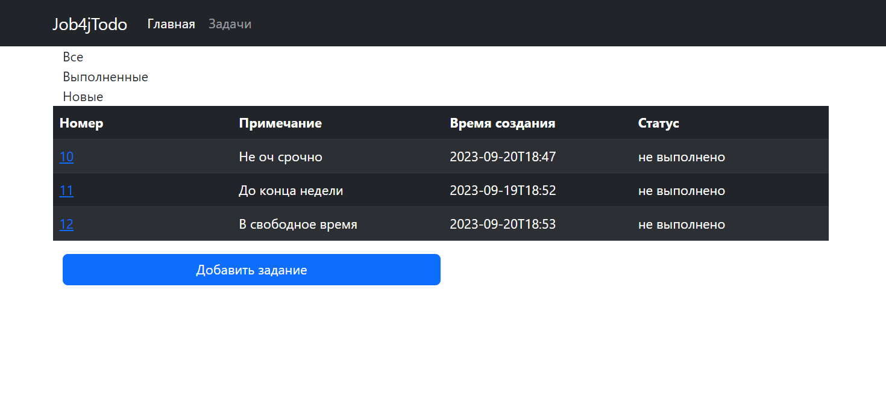
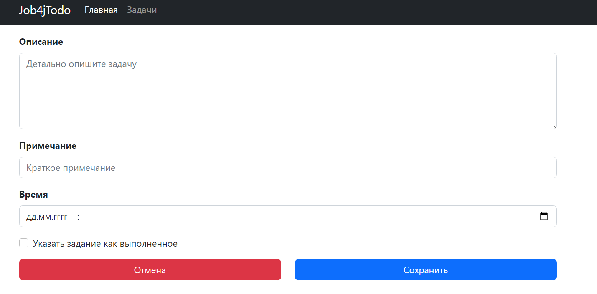

# jod4j_todo
## О проекте:

Проект трекера заданий.

### Функционал, который будет реализован:

:zap: Страница со списком всех зданий.

:zap: Возможность удаления, обновления задания.

:zap: Добавление задания.

### Технологии

__Java17__
__PostgreSQL__
__Maven 3.8__
__Hibernate__

 
 
 

### Список всех заданий.

### Создание задания.

### Страница редактирования и управления состоянием задания.

[Связаться со мной](https://t.me/BeerMaster93)